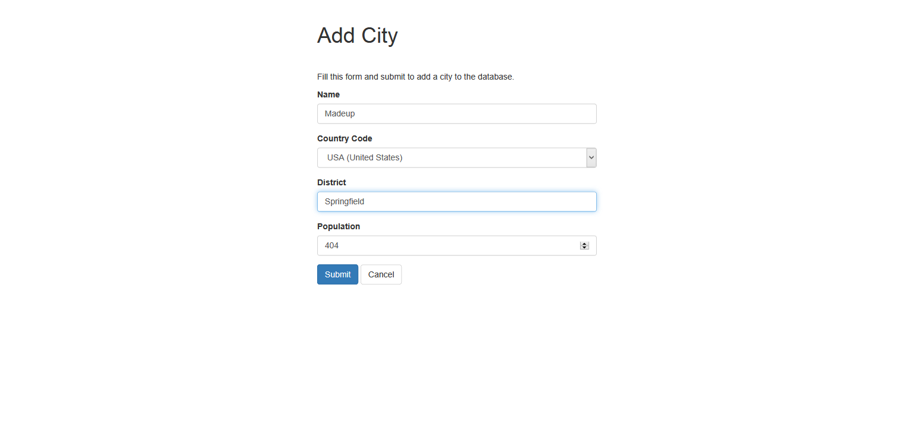
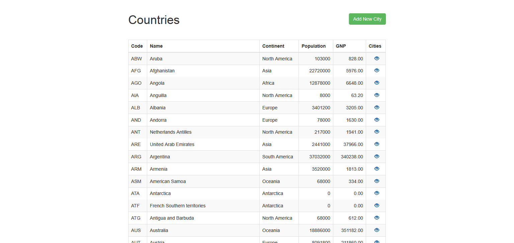
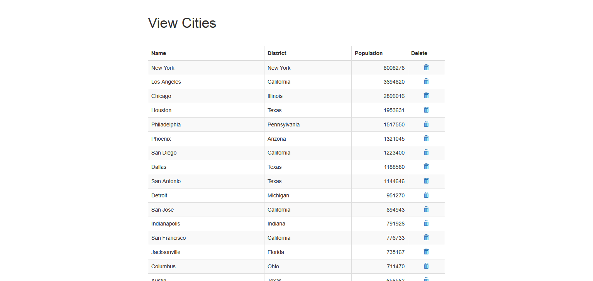

# basic-crud

Basic application with Create, Read and Delete functionality on sample "world" data that can easily be extended or edited to your needs.

Uses [bootstrap](https://getbootstrap.com/) for design. Sample data from [MySQL](https://dev.mysql.com/doc/index-other.html).

 
 
